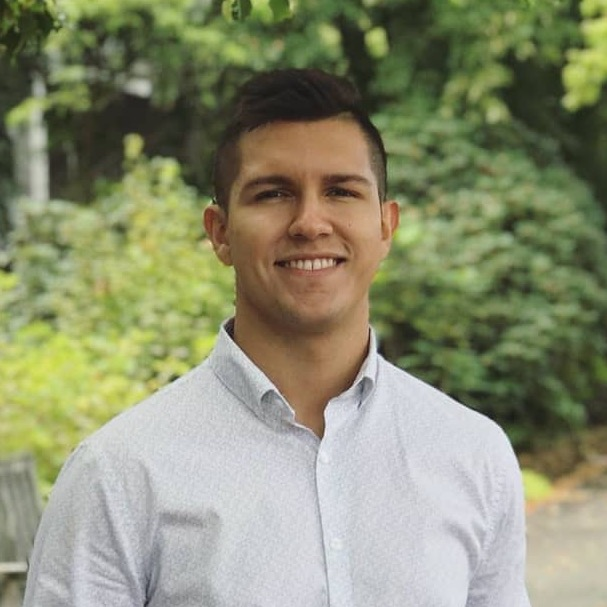
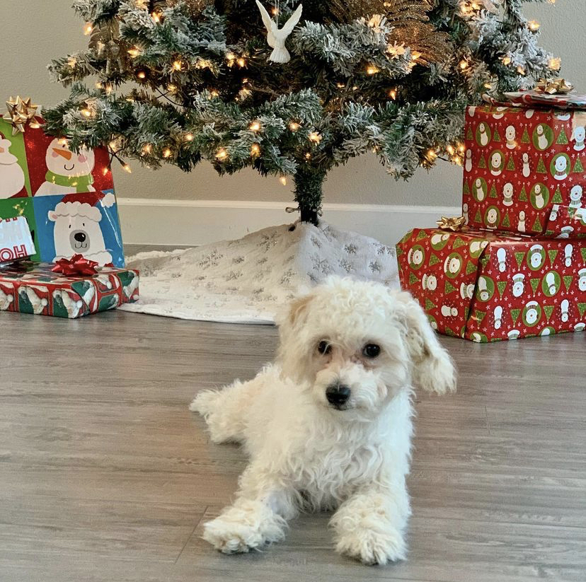
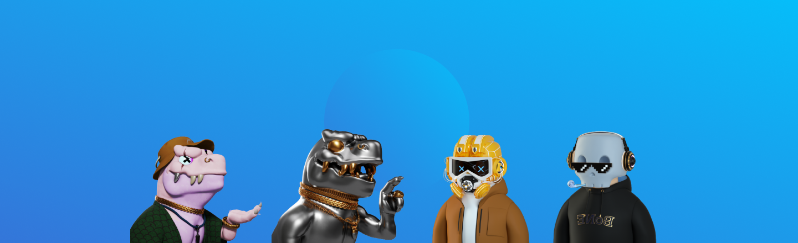

# What's up 👋🏽

  
  

  <strong>javi balvin 🔥</strong>

My name's Javi. I'm a software engineer specializing in **front end engineering** and **serverless app development**. I live in Las Vegas NV 🎰 Why? Cause it's lit 🤟🏽

## 🥞 My stack

Tech stacks change all the time. At the moment of this writing, my current tech stack is:

- React and Next.js
- TypeScript
- AWS (S3, DDB, AppSync, Lambda, etc.)

## 📚 Currently learning

The best and worst thing about me is that I get super excited about almost anything new. On my spare time, I am learning:

- 🕹 Game development (with Unity)
- ⚛️ Blockchain development (in $SOLana)
- 🗿 3D Modelling (in Blender)

### 💼 Career

- Currently I work for [Opendoor](https://www.opendoor.com/) for the Seller Products team! 🔥
- prev: [AWS](https://aws.amazon.com/) in the ProServe team
- prev: [RedEye Apps](https://www.redeye.co/) doing stuff with Vue

## My puppy

I am the proud dad of a beautiful malti-poo: Coco.

  
  

  <strong>The beautiful coco baby 🐶</strong>

## Collectibles

I am pretty passionate about NFTs (because of the huge potential to disrupt many industries – gaming for example). Below is a quick image of my favorite holdings:

<!--
Made with 🧠
-->
